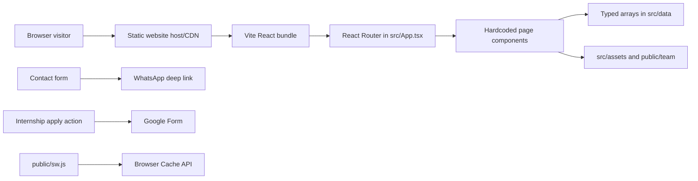
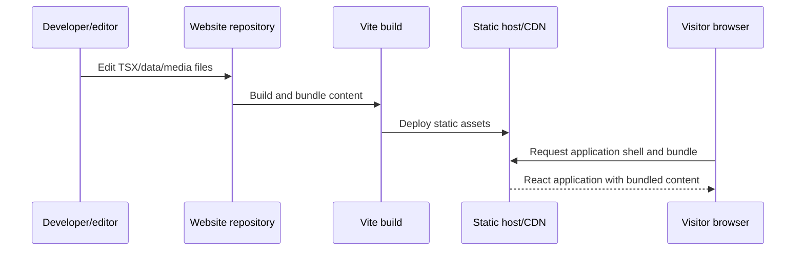
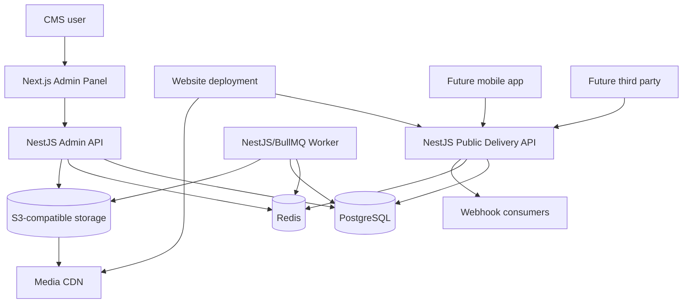
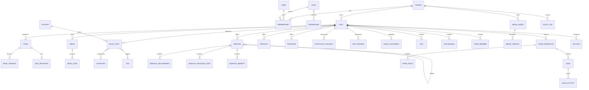
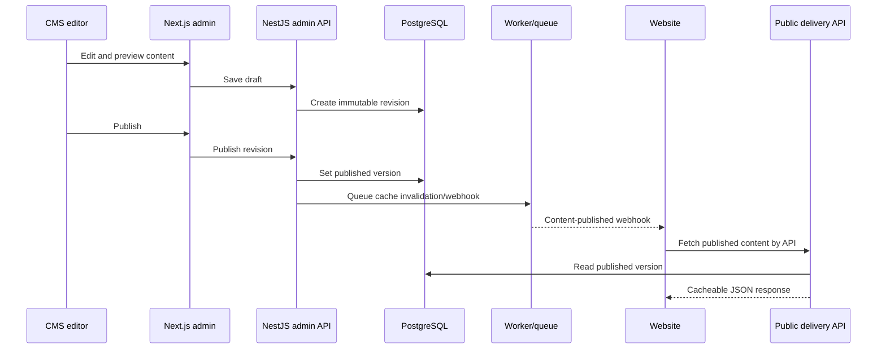
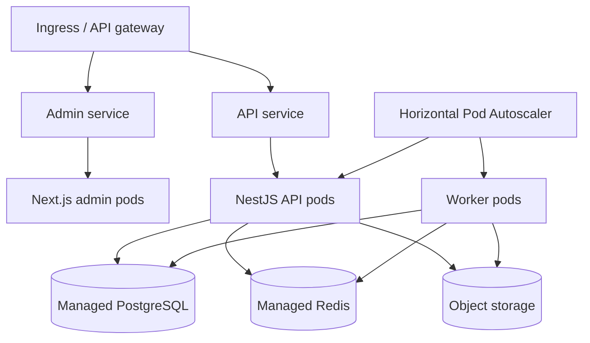
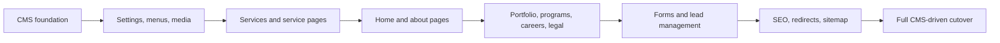

# Headless CMS Microservice Platform

## Software Architecture Document

**Prepared for:** JAC Media Land website  
**Repository assessed:** `d:\website\website`  
**Assessment date:** June 10, 2026  
**Document status:** Proposed target architecture and implementation roadmap  

---

## 1. Executive Summary

The current website is a client-rendered React/Vite single-page application. It has no backend, database, authentication, content API, or persistent lead capture. Most content is hardcoded directly in React page components. Service catalogue content is the strongest existing structured-content area because it is stored in typed arrays in `src/data/services.ts` and `src/data/serviceDetails.ts`.

The recommended target is a **separate, independently deployable CMS platform repository**:

- `cms-platform` is a standalone codebase containing a Next.js admin application, NestJS API, background worker, and shared contracts.
- The existing website remains a separate codebase and deployment.
- The website communicates with the CMS only through a versioned public REST API and media CDN URLs.
- PostgreSQL is the system of record, Redis provides caching and queues, and S3-compatible storage holds media.
- Multi-tenancy is implemented from the first migration through `tenant_id` and `site_id`, PostgreSQL row-level security, tenant-scoped cache keys, and tenant-scoped storage prefixes.
- The CMS starts as a modular monolith with clear domain modules. This gives microservice-grade deployment independence without prematurely splitting the CMS into many operational services.

The highest-priority migration targets are global settings/contact details, menus, services, pages, team members, programs, portfolio projects, legal documents, media, SEO metadata, and lead capture. Blogs, products, FAQs, testimonials, and job openings should be available in the CMS schema even though the current website does not yet render them.

---

## 2. Scope and Repository Evidence

This document is based on the complete application source and configuration present in the repository, including:

- Application entry and routing: `src/main.tsx`, `src/App.tsx`
- Global layout: `src/layout/Navbar.tsx`, `src/layout/Footer.tsx`
- Pages: `src/pages/*.tsx`
- Shared page rendering: `src/components/ServiceDetailPage.tsx`
- Structured content: `src/data/services.ts`, `src/data/serviceDetails.ts`
- Contact flow: `src/pages/Contact.tsx`, `src/utils/whatsapp.ts`
- Media: `src/assets/*`, `public/team/*`, `public/*`
- SEO shell and service worker: `index.html`, `public/sw.js`
- Dependencies and scripts: `package.json`, `vite.config.ts`, `tsconfig*.json`
- Existing tests: `src/data/*.test.ts`, `src/utils/whatsapp.test.ts`

No backend source, API server, ORM configuration, database schema, authentication provider, analytics integration, or CMS exists in this repository.

---

## 3. Current Website Assessment

### 3.1 Technology Stack

| Area | Current implementation | Evidence |
|---|---|---|
| Frontend | React 19 + TypeScript | `package.json`, `src/main.tsx` |
| Build tooling | Vite 8 | `package.json`, `vite.config.ts` |
| Routing | React Router DOM 7 using `BrowserRouter` | `src/App.tsx` |
| Styling | One large global CSS file, inline styles, and `styled-components` for the loader | `src/index.css`, page components, `src/components/Loader.tsx` |
| Icons | `react-icons` | Multiple components/pages |
| State | Local component state only | `Navbar.tsx`, `Contact.tsx`, `Portfolio.tsx`, `Loader.tsx` |
| Persistence | Browser `localStorage` for theme only | `src/layout/Navbar.tsx`, `src/components/Loader.tsx` |
| Offline/cache | Custom service worker for static assets and application shell | `public/sw.js` |
| Tests | Node test runner for service data, portfolio source checks, and WhatsApp URL generation | `package.json`, `src/**/*.test.ts` |
| Backend/API | None | No server dependencies or API modules |
| Database | None | No ORM, migrations, schema, or database dependencies |
| Authentication | None | No login, sessions, users, or authorization code |

### 3.2 Current Runtime Architecture



### 3.3 Routing Architecture and Page Inventory

All application routes are statically declared in `src/App.tsx`. There is no CMS-controlled route resolver, server-side rendering, or route-level data loading.

| Route | Component | Current content source | CMS migration target |
|---|---|---|---|
| `/` | `src/pages/Home.tsx` | Hardcoded JSX arrays and imported local media | `Page(home)` with structured homepage blocks and referenced services/settings |
| `/about` | `src/pages/About.tsx` | Hardcoded story, values, process, team array, founder, local media | `Page`, `TeamMember`, `Settings`, `MediaAsset` |
| `/portfolio` | `src/pages/Portfolio.tsx` | Local filter and deployed-project arrays | `PortfolioProject`, `Category`, `Page` |
| `/services` | `src/pages/Services.tsx` | Page copy plus `src/data/services.ts` | `Page`, `Service` |
| `/services/graphic-design` | Thin page wrapper + `ServiceDetailPage` | `services.ts` + `serviceDetails.ts` | `Service` and related services |
| `/services/app-development` | Thin page wrapper + `ServiceDetailPage` | `services.ts` + `serviceDetails.ts` | `Service` and related services |
| `/services/website-development` | Thin page wrapper + `ServiceDetailPage` | `services.ts` + `serviceDetails.ts` | `Service` and related services |
| `/services/seo-marketing` | Thin page wrapper + `ServiceDetailPage` | `services.ts` + `serviceDetails.ts` | `Service` and related services |
| `/services/ui-ux-design` | Thin page wrapper + `ServiceDetailPage` | `services.ts` + `serviceDetails.ts` | `Service` and related services |
| `/services/digital-marketing` | Thin page wrapper + `ServiceDetailPage` | `services.ts` + `serviceDetails.ts` | `Service` and related services |
| `/services/social-media` | Thin page wrapper + `ServiceDetailPage` | `services.ts` + `serviceDetails.ts` | `Service` and related services |
| `/programs` | `src/pages/Programs.tsx` | Hardcoded benefits and program arrays | `Program`, `Page`, `MediaAsset` |
| `/programs/internship` | `src/pages/InternshipDetails.tsx` | Hardcoded domains, benefits, contact data, Google Form URL | `Program`, `FormDefinition`, `Settings` |
| `/contact` | `src/pages/Contact.tsx` | Hardcoded copy/settings; client-side WhatsApp flow | `Page`, `Settings`, `FormDefinition`, `Lead` |
| `/careers` | `src/pages/Careers.tsx` | Hardcoded benefits, values, and hiring steps | `Page`, `JobOpening`, `FormDefinition` |
| `/privacy` | `src/pages/PrivacyPolicy.tsx` | Hardcoded legal sections | `LegalDocument`, `SEO` |
| `/terms` | `src/pages/TermsOfService.tsx` | Hardcoded legal sections | `LegalDocument`, `SEO` |
| `*` | `src/pages/NotFound.tsx` | Hardcoded fallback | Website-owned system page with optional CMS copy |

### 3.4 Page and Content Structure

The repository currently uses three content patterns:

1. **Typed structured data:**  
   `src/data/services.ts` defines seven service summaries. `src/data/serviceDetails.ts` defines deliverables, process steps, benefits, related services, CTA copy, and optional technologies. `src/components/ServiceDetailPage.tsx` renders this data.

2. **Page-local arrays:**  
   Examples include team members in `src/pages/About.tsx`, portfolio projects in `src/pages/Portfolio.tsx`, programs in `src/pages/Programs.tsx`, and careers values in `src/pages/Careers.tsx`.

3. **Hardcoded JSX content:**  
   Most headings, paragraphs, CTAs, contact details, navigation, footer, legal copy, statistics, industries, and culture content are embedded directly in components.

Several older components are currently not imported by active pages: `Hero.tsx`, `AboutSnippet.tsx`, `WhatWeDo.tsx`, `HowWeAre.tsx`, `Highlights.tsx`, `Industries.tsx`, `TrustedBy.tsx`, `CompanyLogos.tsx`, and `SpaceVideoPlayer.tsx`. Their content should be reviewed during migration rather than automatically imported.

### 3.5 Existing Database Model

There is no existing database model.

The closest equivalents to records are in-memory TypeScript objects:

- `ServiceDefinition` in `src/data/services.ts`
- `ServiceDetailDefinition`, `DetailItem`, and `ProcessStep` in `src/data/serviceDetails.ts`
- Page-local arrays for team members, programs, portfolio projects, legal sections, benefits, values, and hiring steps

These objects are bundled into the frontend at build time and cannot be edited without a code change and redeployment.

### 3.6 Existing API Inventory

There are no first-party APIs.

| Integration | Direction | Current implementation | Persistence |
|---|---|---|---|
| WhatsApp enquiry | Browser to WhatsApp | `createWhatsAppUrl()` in `src/utils/whatsapp.ts`; opened by `Contact.tsx` | None in website |
| WhatsApp meeting request | Browser to WhatsApp | `createWhatsAppGreeting()` | None in website |
| Internship application | Browser to Google Forms | External URL in `InternshipDetails.tsx` | Outside repository |
| Social links | Browser to external social networks | Hardcoded in `Footer.tsx` | None |
| Portfolio links | Browser to deployed external sites | Hardcoded in `Portfolio.tsx` | None |
| Phone/email links | Browser native handlers | Hardcoded `tel:` and `mailto:` links | None |

The `fetch()` calls in `public/sw.js` only implement caching; they are not application APIs.

### 3.7 Authentication and Authorization

No authentication or authorization exists. The site is public. The only browser-persisted setting is the selected visual theme.

### 3.8 SEO Implementation

Current SEO support is minimal:

- A single global title, `JAC Media Land - Making Sense`, exists in `index.html`.
- `index.html` includes viewport and favicon metadata.
- No route-specific titles or descriptions were found.
- No Open Graph, Twitter Card, canonical URL, robots metadata, XML sitemap, or structured data was found.
- The app is client-rendered through `BrowserRouter`, so crawlers initially receive the same static HTML shell for every route.

CMS-managed SEO metadata is recommended, but the website also needs a rendering strategy capable of exposing that metadata. A later Next.js/SSR or prerender migration would improve SEO materially; the CMS itself must remain framework-independent.

### 3.9 Media Management

Current media is file-based:

- Bundled imports from `src/assets/*`
- Publicly served team images from `public/team/*`
- Duplicate/raw team source images in the repository-root `team/*`
- Public favicon, logo, and icon files in `public/*`

There is no media library, metadata, ownership, alt-text workflow, transformation pipeline, CDN policy, or usage tracking. `public/sw.js` caches image extensions with a cache-first policy. After CMS integration, remote media URLs and cache invalidation must be handled explicitly.

### 3.10 Dynamic and Static Content

**Dynamic only in the browser:**

- Theme selection
- Portfolio category filtering
- Contact form state and WhatsApp URL generation
- Mobile/desktop navigation state
- Scroll animations
- Loader timing

**Static at build time:**

- Every page's editorial content
- Services and service details
- Team, founder, programs, portfolio, legal content
- Navigation, footer, contact details, social links
- Images and media references
- SEO title

### 3.11 Current Content Flow



### 3.12 Repository-Grounded Risks and Inconsistencies

- Contact details are duplicated across `Footer.tsx`, `Contact.tsx`, and `InternshipDetails.tsx`.
- `Contact.tsx` identifies headquarters as Erode, while `PrivacyPolicy.tsx` and `TermsOfService.tsx` reference Coimbatore. A central settings model should resolve this before publication.
- Privacy/legal text describes stored form data, resumes, newsletters, analytics, and cookies, but the repository contains no first-party persistence, newsletter, analytics, or cookie implementation.
- Homepage services in `Home.tsx` duplicate service content from `src/data/services.ts`.
- Unused `WhatWeDo.tsx` includes a link to `/services/security`, but no such route exists in `src/App.tsx`.
- The service worker cache strategy is unaware of a future CMS API and could serve stale content unless API requests are excluded or versioned.
- The forced loader delays route rendering for approximately 2.3 seconds in `src/components/Loader.tsx`.
- `src/index.css` is a very large global stylesheet, increasing the risk of page-level changes affecting unrelated routes.
- New files are ignored by default in `.gitignore`; repository governance should be corrected before large-scale migration work.

---

## 4. Content Extraction and CMS Inventory

### 4.1 Content Migration Inventory

| Content item | Current location and implementation | Recommended CMS model |
|---|---|---|
| Homepage hero | `src/pages/Home.tsx`, hardcoded copy and local image | `Page` with typed `hero` block and `MediaAsset` |
| Homepage promises | `Home.tsx`, duplicated JSX array | `Page` block: `feature_list` |
| Homepage about snippet | `Home.tsx`, hardcoded JSX | `Page` block referencing `Settings` or about page |
| Industries | `Home.tsx`; legacy duplicate in `components/Industries.tsx` | `Industry` entries referenced by page block |
| Highlights/statistics | `Home.tsx`; legacy duplicate in `components/Highlights.tsx` | `Statistic` entries referenced by page block |
| Homepage service cards | `Home.tsx`, duplicates structured services | Query/reference to `Service` |
| Culture highlights | `Home.tsx` and `About.tsx` | `Page` blocks or reusable `CultureValue` entries |
| About story/process | `src/pages/About.tsx` | `Page` blocks |
| Founder and team | `About.tsx`, local array and local media | `TeamMember` with role, biography, ordering, and media |
| Services catalogue | `src/data/services.ts` | `Service` |
| Service details | `src/data/serviceDetails.ts` | `Service`, `ServiceDeliverable`, `ServiceProcessStep`, `ServiceBenefit`, relations |
| Portfolio projects/categories | `src/pages/Portfolio.tsx` | `PortfolioProject`, `Category`, `MediaAsset` |
| Programs | `src/pages/Programs.tsx` | `Program` |
| Internship details | `src/pages/InternshipDetails.tsx` | `Program`, `FormDefinition`, `Settings` |
| Careers copy/values/process | `src/pages/Careers.tsx` | `Page` blocks |
| Job vacancies | Not currently implemented | `JobOpening` |
| Contact details/address/social links | `Footer.tsx`, `Contact.tsx`, `InternshipDetails.tsx` | `Settings`, `SocialLink`, `OfficeLocation` |
| Contact enquiry | `Contact.tsx` opens WhatsApp only | `FormDefinition`, `Lead`, optional WhatsApp notification |
| Navigation | `src/layout/Navbar.tsx` and duplicated footer links | `Menu`, `MenuItem` |
| Footer | `src/layout/Footer.tsx` | `Settings`, `Menu`, `SocialLink` |
| Privacy policy | `src/pages/PrivacyPolicy.tsx` | `LegalDocument` with revisions |
| Terms of service | `src/pages/TermsOfService.tsx` | `LegalDocument` with revisions |
| SEO metadata | One global title in `index.html` | `SeoMetadata` on every publishable entity |
| Images/videos | `src/assets`, `public/team`, `team` | `MediaAsset`, variants, usage references |
| Blogs/categories/tags/authors | Not currently implemented | `BlogPost`, `Category`, `Tag`, `Author` |
| Products | Not currently implemented | `Product` |
| FAQs/testimonials | Not currently implemented | `Faq`, `FaqGroup`, `Testimonial` |

### 4.2 Extraction Rules

- Migrate only active content after editorial review; do not automatically publish unused legacy component content.
- Preserve current service slugs and relationships because tests enforce a complete seven-service catalogue.
- Preserve existing portfolio category labels and empty categories where editorially desired.
- Resolve conflicting addresses, legal contacts, and claims before migration.
- Convert local media into CMS media records with alt text, checksum, dimensions, MIME type, and references.
- Store presentation icons as controlled icon keys, not executable React components.
- Keep website-owned layout and behavior in the website codebase. The CMS controls content and composition data, not arbitrary JavaScript or CSS.

---

## 5. Target Headless CMS Architecture

### 5.1 Architecture Decision

Three viable approaches were considered:

| Approach | Strength | Limitation | Decision |
|---|---|---|---|
| Generic page-builder-only CMS | Highly flexible page composition | Weak validation and difficult cross-channel reuse | Not recommended as the primary model |
| Typed modular CMS with controlled page blocks | Strong validation, reusable content, mobile/third-party readiness | Requires deliberate schema design | **Recommended** |
| Adopt an off-the-shelf headless CMS | Fast initial setup | Less control over tenancy, lead workflows, and custom security model | Possible alternative, not the selected design |

The recommended design combines typed domain models with a controlled set of page blocks. Services, programs, people, portfolio projects, blogs, products, FAQs, testimonials, menus, forms, leads, and settings remain typed entities. Pages compose these entities using validated blocks.

### 5.2 System Boundaries

The CMS must live in a new repository and must never be imported into the website source tree.

```text
website/                  # Existing and independently deployable
cms-platform/             # New, separate repository and deployment lifecycle
mobile-app/               # Future consumer
partner-integration/      # Future consumer
```

### 5.3 CMS Platform Components



### 5.4 Recommended Technology Stack

| Layer | Recommendation |
|---|---|
| Admin frontend | Next.js + React + TypeScript |
| API backend | NestJS + TypeScript |
| Data access | Prisma or TypeORM; Prisma is recommended for schema clarity and migrations |
| Database | PostgreSQL |
| Cache/queue | Redis + BullMQ |
| Media | S3-compatible object storage + CDN |
| Authentication | JWT access tokens + rotating refresh tokens |
| Authorization | RBAC with tenant/site memberships |
| API | REST first; optional read-only GraphQL after REST contracts stabilize |
| API docs | Swagger/OpenAPI generated by NestJS |
| Validation | `class-validator`/`class-transformer` at API boundary plus database constraints |
| Observability | OpenTelemetry, structured logs, metrics, traces, error tracking |

### 5.5 Proposed CMS Repository Structure

```text
cms-platform/
  apps/
    admin/                 # Next.js admin UI
    api/                   # NestJS public and admin APIs
    worker/                # Media, webhook, email, and indexing jobs
  packages/
    contracts/             # Shared DTO and API types
    authz/                 # Permission constants and policy helpers
    config/                # Validated environment configuration
    ui/                    # Admin design system
  prisma/
    schema.prisma
    migrations/
    seed.ts
  deploy/
    docker/
    kubernetes/
  docs/
    api/
    runbooks/
```

The API and admin may deploy separately while remaining in one CMS-owned repository. The website repository contains only a generated or hand-maintained API client contract, never CMS source code.

### 5.6 Domain Module Boundaries

```text
auth, users, roles, permissions
tenants, sites, domains, locales
pages, page-versions, publishing
blogs, taxonomy, authors
services, products, programs, portfolio, careers
faqs, testimonials, team
media
seo
menus
forms, leads
settings
audit, webhooks
```

Each module owns its validation, service layer, persistence access, API controllers, permission checks, and tests.

---

## 6. CMS Domain and Database Design

### 6.1 Core Data Conventions

- UUID primary keys.
- `tenant_id` on every tenant-owned row.
- `site_id` on site-specific content.
- UTC timestamps: `created_at`, `updated_at`, optional `deleted_at`.
- Publishable entities use `status`, `published_at`, `version`, and immutable revision records.
- Human-readable URLs use unique site-scoped slugs.
- Flexible page block payloads use validated JSONB with explicit block type/version.
- Soft deletion is used for editorial recovery; audit logs remain immutable.

### 6.2 ER Diagram



### 6.3 Table Definitions

#### Tenancy, Identity, and Authorization

| Table | Key columns | Purpose |
|---|---|---|
| `tenants` | `id`, `name`, `slug`, `status`, timestamps | Top-level customer/organization |
| `sites` | `id`, `tenant_id`, `name`, `key`, `default_locale`, `status` | Independently published website/channel |
| `site_domains` | `id`, `site_id`, `hostname`, `is_primary` | Domain-to-site resolution |
| `users` | `id`, `email`, `password_hash`, `status`, `last_login_at` | CMS identities |
| `roles` | `id`, `tenant_id`, `name`, `scope` | Tenant or site roles |
| `permissions` | `id`, `key`, `description` | Stable permission catalogue |
| `role_permissions` | `role_id`, `permission_id` | Role permission mapping |
| `memberships` | `user_id`, `tenant_id`, `site_id`, `role_id` | User access to tenant/site |
| `refresh_tokens` | `id`, `user_id`, `token_hash`, `expires_at`, `revoked_at`, `family_id` | Rotating session tokens |

#### Pages, Publishing, SEO, and Navigation

| Table | Key columns | Purpose |
|---|---|---|
| `pages` | `id`, `tenant_id`, `site_id`, `slug`, `title`, `template_key`, `status`, `published_version_id` | Route-level page record |
| `page_versions` | `id`, `page_id`, `version`, `blocks_json`, `created_by`, `created_at` | Immutable page revisions |
| `seo_metadata` | `id`, `site_id`, `entity_type`, `entity_id`, `title`, `description`, `canonical_url`, `robots`, `open_graph_json`, `schema_json` | SEO data for any publishable entity |
| `menus` | `id`, `site_id`, `key`, `label` | Named navigation collection |
| `menu_items` | `id`, `menu_id`, `parent_id`, `label`, `link_type`, `target`, `sort_order`, `visibility_json` | Nested menu entries |
| `settings` | `id`, `site_id`, `namespace`, `key`, `value_json` | Typed global/site settings |
| `legal_documents` | `id`, `site_id`, `type`, `slug`, `title`, `body_json`, `effective_at`, `status` | Privacy, terms, and future legal content |

#### Editorial and Business Content

| Table | Key columns | Purpose |
|---|---|---|
| `blog_posts` | `id`, `site_id`, `author_id`, `slug`, `title`, `excerpt`, `body_json`, `status`, `published_at` | Blog content |
| `categories` | `id`, `site_id`, `scope`, `slug`, `name` | Categories for blogs/portfolio/products |
| `tags` | `id`, `site_id`, `slug`, `name` | Reusable tags |
| `authors` | `id`, `site_id`, `name`, `bio`, `media_asset_id` | Editorial authors |
| `services` | `id`, `site_id`, `slug`, `title`, `subtitle`, `tagline`, `description`, `icon_key`, `featured`, `sort_order`, `status` | Service catalogue and detail root |
| `service_deliverables` | `id`, `service_id`, `title`, `description`, `icon_key`, `sort_order` | Current deliverables arrays |
| `service_process_steps` | `id`, `service_id`, `title`, `description`, `sort_order` | Current process arrays |
| `service_benefits` | `id`, `service_id`, `title`, `description`, `icon_key`, `sort_order` | Current benefits arrays |
| `service_relations` | `service_id`, `related_service_id`, `sort_order` | Current related-service paths |
| `service_technologies` | `service_id`, `name`, `sort_order` | Optional technology list |
| `products` | `id`, `site_id`, `slug`, `name`, `description`, `attributes_json`, `status` | Future product catalogue |
| `programs` | `id`, `site_id`, `slug`, `title`, `summary`, `body_json`, `status_label`, `application_url`, `status` | Programs and internship |
| `portfolio_projects` | `id`, `site_id`, `category_id`, `slug`, `title`, `industry`, `summary`, `external_url`, `media_asset_id`, `status` | Current deployed-project list |
| `job_openings` | `id`, `site_id`, `slug`, `title`, `location`, `employment_type`, `body_json`, `status`, `closes_at` | Future careers openings |
| `faqs` | `id`, `site_id`, `group_key`, `question`, `answer_json`, `sort_order`, `status` | FAQs |
| `testimonials` | `id`, `site_id`, `person_name`, `company`, `quote`, `media_asset_id`, `status` | Testimonials |
| `team_members` | `id`, `site_id`, `name`, `role`, `bio`, `media_asset_id`, `is_leadership`, `sort_order`, `status` | Founder and team |
| `industries` | `id`, `site_id`, `slug`, `name`, `icon_key`, `sort_order` | Homepage industry content |
| `statistics` | `id`, `site_id`, `key`, `value`, `label`, `sort_order` | Homepage highlights |

#### Media, Forms, Leads, Operations

| Table | Key columns | Purpose |
|---|---|---|
| `media_assets` | `id`, `tenant_id`, `site_id`, `storage_key`, `file_name`, `mime_type`, `size_bytes`, `width`, `height`, `alt_text`, `checksum`, `status` | Media library records |
| `media_variants` | `id`, `media_asset_id`, `variant_key`, `storage_key`, `width`, `height`, `format`, `size_bytes` | Generated responsive assets |
| `form_definitions` | `id`, `site_id`, `key`, `name`, `notification_config_json`, `status` | Contact, internship, careers, and future forms |
| `form_fields` | `id`, `form_definition_id`, `key`, `label`, `type`, `required`, `validation_json`, `sort_order` | Admin-configurable form schema |
| `leads` | `id`, `tenant_id`, `site_id`, `form_definition_id`, `status`, `contact_json`, `payload_json`, `source_json`, `assigned_to`, timestamps | Durable lead submissions |
| `lead_activities` | `id`, `lead_id`, `type`, `note`, `actor_user_id`, `created_at` | Lead history |
| `audit_logs` | `id`, `tenant_id`, `site_id`, `actor_user_id`, `action`, `entity_type`, `entity_id`, `before_json`, `after_json`, `ip_address`, `created_at` | Immutable security/editorial audit |
| `webhooks` | `id`, `tenant_id`, `site_id`, `url`, `secret_hash`, `event_types`, `status` | Website and integration notifications |
| `webhook_deliveries` | `id`, `webhook_id`, `event_type`, `payload_json`, `status`, `attempt_count`, timestamps | Retryable delivery records |

### 6.4 Required Constraints and Indexes

- Unique `sites.key`.
- Unique `(site_id, slug)` for pages and each slugged content type.
- Unique `(site_id, key)` for menus, form definitions, and typed settings.
- Unique `(role_id, permission_id)` and `(user_id, tenant_id, site_id, role_id)`.
- Check constraints for allowed statuses.
- Foreign keys use restrictive deletes for published content and cascading deletes only for owned child rows.
- Index all `tenant_id`, `site_id`, `status`, `published_at`, and slug lookup paths.
- Use PostgreSQL row-level security policies on all tenant-owned tables.
- Use optimistic concurrency through `version` or `updated_at` checks on editorial updates.

---

## 7. API Design and Website Integration

### 7.1 API Principles

- REST is the initial supported contract.
- Public delivery and admin APIs are separated by route and authorization policy.
- Version all endpoints under `/v1`.
- Public responses contain only published content.
- Admin responses include drafts, revisions, permissions, and audit context.
- Every response is tenant/site scoped.
- Use OpenAPI/Swagger as the canonical contract.
- Use ETags and `Cache-Control` for public reads.
- Use idempotency keys for lead creation and write operations triggered by external integrations.

### 7.2 Public API Inventory

```text
GET  /v1/public/sites/{siteKey}
GET  /v1/public/sites/{siteKey}/settings
GET  /v1/public/sites/{siteKey}/menus/{menuKey}
GET  /v1/public/sites/{siteKey}/pages/by-path?path=/
GET  /v1/public/sites/{siteKey}/services
GET  /v1/public/sites/{siteKey}/services/{slug}
GET  /v1/public/sites/{siteKey}/portfolio-projects
GET  /v1/public/sites/{siteKey}/programs
GET  /v1/public/sites/{siteKey}/programs/{slug}
GET  /v1/public/sites/{siteKey}/team-members
GET  /v1/public/sites/{siteKey}/blogs
GET  /v1/public/sites/{siteKey}/blogs/{slug}
GET  /v1/public/sites/{siteKey}/faqs
GET  /v1/public/sites/{siteKey}/legal/{type}
POST /v1/public/sites/{siteKey}/forms/{formKey}/submissions
```

### 7.3 Admin API Inventory

```text
POST /v1/auth/login
POST /v1/auth/refresh
POST /v1/auth/logout

GET|POST|PATCH|DELETE /v1/admin/sites/{siteId}/pages
POST                  /v1/admin/sites/{siteId}/pages/{id}/publish
GET|POST|PATCH|DELETE /v1/admin/sites/{siteId}/services
GET|POST|PATCH|DELETE /v1/admin/sites/{siteId}/blogs
GET|POST|PATCH|DELETE /v1/admin/sites/{siteId}/programs
GET|POST|PATCH|DELETE /v1/admin/sites/{siteId}/portfolio-projects
GET|POST|PATCH|DELETE /v1/admin/sites/{siteId}/team-members
GET|POST|PATCH|DELETE /v1/admin/sites/{siteId}/media
GET|POST|PATCH|DELETE /v1/admin/sites/{siteId}/menus
GET|POST|PATCH|DELETE /v1/admin/sites/{siteId}/forms
GET|PATCH             /v1/admin/sites/{siteId}/leads
GET|PATCH             /v1/admin/sites/{siteId}/seo
GET|PATCH             /v1/admin/sites/{siteId}/settings
GET|POST|PATCH|DELETE /v1/admin/tenants/{tenantId}/users
GET|POST|PATCH|DELETE /v1/admin/tenants/{tenantId}/roles
GET                   /v1/admin/tenants/{tenantId}/audit-logs
```

### 7.4 Route-by-Route Website Migration

| Current route | Current implementation | New CMS-driven implementation |
|---|---|---|
| `/` | Hardcoded `Home.tsx` sections | Fetch published home page, global settings, services, industries, statistics |
| `/about` | Hardcoded `About.tsx` and team array | Fetch about page and ordered `TeamMember` entries |
| `/portfolio` | Local filters/projects | Fetch categories and published `PortfolioProject` entries |
| `/services` | Local page copy + `services.ts` | Fetch services landing page and service list |
| `/services/:slug` | Static wrappers + shared renderer + local data | Add route resolver for slug and fetch `ServiceResponse` |
| `/programs` | Local program arrays | Fetch program landing page and program list |
| `/programs/internship` | Hardcoded internship page and Google Form URL | Fetch `ProgramResponse`; submit CMS form or configured external URL |
| `/contact` | Local form opens WhatsApp | Fetch page/settings/form schema; submit lead API, then optionally offer WhatsApp |
| `/careers` | Static content only | Fetch careers page and open `JobOpening` entries |
| `/privacy` | Hardcoded legal content | Fetch published privacy `LegalDocument` |
| `/terms` | Hardcoded legal content | Fetch published terms `LegalDocument` |
| `*` | Static fallback | Keep website-owned fallback; optionally load global contact/navigation settings |

### 7.5 Representative Public Response

```json
{
  "data": {
    "id": "page_uuid",
    "siteKey": "jac-media-land",
    "path": "/",
    "title": "Home",
    "template": "home",
    "blocks": [
      {
        "type": "hero",
        "version": 1,
        "data": {
          "eyebrow": "JAC Media Land",
          "heading": "Come let's feed your Brand Today with innovation",
          "body": "Many of life's failures...",
          "primaryAction": { "label": "Schedule a call", "href": "/contact" },
          "media": {
            "url": "https://media.example.com/site/home-hero.webp",
            "alt": "Hero illustration"
          }
        }
      },
      {
        "type": "service_grid",
        "version": 1,
        "data": {
          "heading": "What We Do",
          "serviceIds": ["service_uuid_1", "service_uuid_2"]
        }
      }
    ],
    "seo": {
      "title": "JAC Media Land | Digital Services",
      "description": "Digital design, engineering, and marketing services.",
      "canonicalUrl": "https://example.com/"
    },
    "publishedAt": "2026-06-10T09:00:00.000Z",
    "version": 3
  },
  "meta": {
    "requestId": "request_uuid",
    "etag": "W/\"page_uuid:3\""
  }
}
```

### 7.6 Representative Lead Request and Response

```json
POST /v1/public/sites/jac-media-land/forms/contact/submissions
Idempotency-Key: 4f600f16-35dd-4cf3-98dd-e928a893ba76

{
  "name": "Priya Kumar",
  "email": "priya@example.com",
  "phone": "+91 98765 43210",
  "subject": "Website redesign",
  "message": "We need a faster company website.",
  "consent": true,
  "source": {
    "path": "/contact",
    "utmSource": "google"
  }
}
```

```json
{
  "data": {
    "submissionId": "lead_uuid",
    "status": "received",
    "nextActions": [
      {
        "type": "whatsapp",
        "url": "https://wa.me/917338891367?text=..."
      }
    ]
  }
}
```

### 7.7 NestJS DTO Examples

```ts
export class CreateLeadDto {
  @IsString()
  @Length(2, 120)
  name!: string;

  @IsEmail()
  @Length(3, 254)
  email!: string;

  @IsOptional()
  @IsString()
  @Length(7, 32)
  phone?: string;

  @IsString()
  @Length(2, 160)
  subject!: string;

  @IsString()
  @Length(10, 5000)
  message!: string;

  @IsBoolean()
  consent!: boolean;

  @IsOptional()
  @ValidateNested()
  @Type(() => LeadSourceDto)
  source?: LeadSourceDto;
}
```

```ts
export class UpsertServiceDto {
  @IsString()
  @Matches(/^[a-z0-9]+(?:-[a-z0-9]+)*$/)
  @Length(2, 120)
  slug!: string;

  @IsString()
  @Length(2, 160)
  title!: string;

  @IsString()
  @Length(20, 1000)
  description!: string;

  @IsArray()
  @ArrayMinSize(3)
  @ValidateNested({ each: true })
  @Type(() => ServiceCapabilityDto)
  capabilities!: ServiceCapabilityDto[];
}
```

### 7.8 Validation Rules

- Reject unknown fields at the API boundary.
- Normalize and validate slugs; enforce site-scoped uniqueness.
- Limit rich-text/block payload size and allow only registered block types/versions.
- Sanitize rich text on write and encode on render.
- Validate all internal links against allowed site paths and all external links against URL rules.
- Validate media MIME type, size, checksum, dimensions, and extension.
- Require alt text for meaningful published images.
- Require SEO title and description before publication for indexable pages.
- Prevent publication when required references are missing or unpublished.
- Validate lead fields against the published form definition, not only client-supplied HTML.

### 7.9 New Content Flow



### 7.10 Website Integration Strategy

For the current Vite SPA:

- Add a small `src/api/cmsClient.ts` owned by the website repository.
- Add typed query modules for pages, services, menus, settings, and forms.
- Keep presentation components in the website.
- Add loading, error, empty, and stale-cache states.
- Configure `VITE_CMS_PUBLIC_API_URL` and `VITE_CMS_SITE_KEY`.
- Exclude CMS API calls from the current service worker cache or cache only explicitly versioned public GET responses.
- Keep a last-known published content snapshot in CDN/object storage for graceful degradation.

For stronger SEO, plan a later website migration to Next.js or a prerender pipeline. This is independent of the CMS and should not change the API contract.

---

## 8. Multi-Tenant Architecture

### 8.1 Tenant Hierarchy

```text
Tenant
  Site A
  Site B
  Site C
```

A tenant represents an organization. A site represents a separately branded website, mobile content channel, or domain. A tenant may own multiple sites; a user may have different roles per tenant or site.

### 8.2 Isolation and Data Segregation

- Every tenant-owned row includes `tenant_id`.
- Every site-specific row includes both `tenant_id` and `site_id`.
- PostgreSQL row-level security enforces tenant predicates even if application code misses a filter.
- The API sets tenant/site context from validated JWT claims or resolved public site keys.
- Redis keys use `tenant:{tenantId}:site:{siteId}:...`.
- S3 object keys use `tenants/{tenantId}/sites/{siteId}/...`.
- Audit logs record both tenant and site context.
- Webhook secrets and API keys are tenant-scoped.

### 8.3 Database Strategy

**Initial recommendation:** shared PostgreSQL database and shared schema with RLS. This provides efficient operations and supports many small-to-medium sites.

**Upgrade path:** allow a tenant to be assigned a dedicated database for regulatory, scale, or contractual isolation. The domain and API contracts remain unchanged; a tenant-aware connection resolver selects the database.

### 8.4 Security Model

- A user receives no access merely by existing; access requires an active membership.
- Platform administrators are separate from tenant administrators.
- Tenant administrators cannot assign platform-level permissions.
- Site editors cannot access other sites in the same tenant unless explicitly assigned.
- Public site resolution uses an allowlisted `siteKey` or verified domain, never a client-supplied `tenant_id`.

---

## 9. Admin Panel Design

### 9.1 Navigation Structure

```text
Site selector
Dashboard
Content
  Pages
  Services
  Products
  Programs
  Portfolio
  Team
  FAQs
  Testimonials
Blog
  Posts
  Categories
  Tags
  Authors
Media Library
Leads
SEO
Navigation
Forms
Settings
Users & Access
  Users
  Roles
  Permissions
Audit Logs
```

### 9.2 Screen List

| Module | Screens |
|---|---|
| Dashboard | Publish activity, drafts, recent leads, media usage, content health, site status |
| Pages | List, create, edit blocks, preview, compare revisions, publish/unpublish |
| Services/products/programs/portfolio | List, filters, create/edit, relations, ordering, publish |
| Blog | Post list/editor, category/tag management, authors, schedule publishing |
| Media | Grid/list, upload, edit metadata, replace, variants, usage references |
| Leads | Inbox, detail, assignment, status, notes, export |
| SEO | Site defaults, per-content metadata, missing metadata report, redirects |
| Navigation | Menu list, nested drag-and-drop editor, link validation |
| Forms | Form builder, validation, notifications, submissions |
| Settings | Brand, contact data, offices, social links, integrations, locales |
| Users/access | Users, invitations, memberships, roles, permissions |
| Audit logs | Filtered immutable activity history |

### 9.3 Core User Flows

**Publish a page**

1. Select tenant/site.
2. Open page draft.
3. Edit registered blocks and referenced content.
4. Run validation and preview.
5. Submit for review if role requires approval.
6. Publish revision.
7. CMS invalidates cache and sends webhook.

**Upload and use media**

1. Request presigned upload URL.
2. Upload directly to object storage.
3. Worker scans and creates variants.
4. Editor adds alt text and metadata.
5. Editor selects asset from a content field.
6. Usage reference prevents accidental deletion.

**Process a lead**

1. Lead appears in inbox.
2. Staff assigns owner and status.
3. Staff adds notes or records contact activity.
4. Optional notification/integration job runs.
5. Audit log records changes.

### 9.4 Wireframe Descriptions

- **Dashboard:** left navigation, site selector in header, status cards across the top, recent activity and leads below, content-health warnings in a right rail.
- **Page editor:** page identity and SEO tabs at top, block list on the left, selected-block form in the center, responsive preview on the right.
- **Content list:** searchable table with status, owner, updated date, scheduled publication, and bulk actions.
- **Media library:** filterable asset grid with upload drop zone, metadata drawer, variants, and "used by" references.
- **Lead inbox:** queue-style table with filters and ownership; detail drawer shows submission, source, timeline, and actions.
- **Role editor:** permission groups by domain and action with tenant/site scope clearly displayed.

---

## 10. Security Architecture

### 10.1 RBAC

Recommended baseline roles:

| Role | Typical permissions |
|---|---|
| Platform Administrator | Manage all tenants, platform settings, and support operations |
| Tenant Administrator | Manage tenant sites, memberships, roles, integrations |
| Site Administrator | Full access within assigned sites |
| Editor | Create/edit content and media; cannot manage users |
| Publisher | Review and publish/unpublish content |
| SEO Manager | Manage SEO, redirects, and publishing metadata |
| Lead Manager | View and manage leads; no editorial access |
| Auditor | Read-only access to content and audit logs |

Permission keys should be explicit, for example `page.read`, `page.update`, `page.publish`, `media.upload`, `lead.export`, and `membership.manage`.

### 10.2 Authentication

- Short-lived JWT access token, recommended lifetime 15 minutes.
- Rotating refresh token, recommended maximum lifetime 30 days.
- Store refresh token hashes, token family, device metadata, expiration, and revocation state.
- Use `HttpOnly`, `Secure`, `SameSite=Strict` cookies for admin refresh tokens.
- Require MFA for platform and tenant administrators before production launch.
- Rate-limit login, refresh, password reset, and invitation acceptance.

### 10.3 API and Application Security

- Strict CORS allowlist for admin and known website origins.
- Helmet/security headers and a restrictive Content Security Policy.
- CSRF tokens for cookie-authenticated state-changing admin requests.
- DTO validation with whitelist mode and unknown-field rejection.
- Sanitization for rich text and block payloads.
- Parameterized ORM queries and no raw SQL without review.
- Rate limits scoped by IP, tenant, user, site, and endpoint class.
- CAPTCHA or equivalent abuse controls on public forms when thresholds are exceeded.
- S3 presigned uploads with short expiration, content limits, malware scanning, and non-public source buckets.
- Encrypt data in transit and at rest.
- Redact secrets and personal data from logs.
- Immutable audit events for authentication, access changes, publishing, deletion, exports, and lead access.

### 10.4 XSS and CSRF

- Never allow arbitrary HTML/JavaScript page blocks.
- Sanitize rich text on write and render with an allowlisted renderer.
- Encode all text fields by default.
- Use CSRF protection on admin cookie sessions.
- Public bearer-token API consumers do not require CSRF protection but still require CORS and rate limiting.

---

## 11. Deployment Architecture

### 11.1 Independent Deployments

| Deployable | Contains | Can deploy without |
|---|---|---|
| Website | Existing React/Vite application and CMS API client | CMS source code |
| CMS Admin | Next.js admin UI | Website source code |
| CMS API | NestJS public/admin APIs | Website and admin source at runtime |
| CMS Worker | Queue consumers | Website source code |
| PostgreSQL | CMS persistent data | Website source code |
| Redis | Cache, rate-limit state, queues | Website source code |
| Object storage/CDN | Media objects and variants | Website source code |

### 11.2 Docker Architecture

```text
cms-platform/
  admin Docker image
  api Docker image
  worker Docker image
  postgres service for local development only
  redis service for local development only
  minio service for local development only
```

Production managed PostgreSQL, Redis, and S3-compatible storage are preferred over self-hosted stateful containers.

### 11.3 Kubernetes Architecture



Recommended production controls:

- Separate namespaces/environments for development, staging, and production.
- Pod disruption budgets and readiness/liveness probes.
- Autoscaling on CPU, latency, and queue depth.
- Network policies restricting database/Redis access.
- Database backups, point-in-time recovery, and restore drills.
- Object storage versioning and lifecycle policies.

### 11.4 CI/CD Architecture

**CMS pipeline**

1. Install locked dependencies.
2. Lint, type-check, unit test, integration test.
3. Validate OpenAPI contract and database migrations.
4. Build admin/API/worker images.
5. Scan dependencies, images, and secrets.
6. Deploy to staging.
7. Run smoke and migration tests.
8. Require approval for production.
9. Run backward-compatible migration, deploy API/worker/admin, verify, then clean up old schema later.

**Website pipeline**

1. Build/test website independently.
2. Validate generated CMS client contract.
3. Deploy without CMS source.
4. Smoke-test public CMS API connectivity and cached fallback behavior.

### 11.5 Environment Variables

```text
# Shared
NODE_ENV
LOG_LEVEL
OTEL_EXPORTER_OTLP_ENDPOINT

# API
PORT
DATABASE_URL
REDIS_URL
JWT_ACCESS_SECRET
JWT_ACCESS_TTL
JWT_REFRESH_PEPPER
ADMIN_ALLOWED_ORIGINS
PUBLIC_ALLOWED_ORIGINS
PUBLIC_API_BASE_URL
ADMIN_APP_URL

# Storage
S3_ENDPOINT
S3_REGION
S3_BUCKET
S3_ACCESS_KEY_ID
S3_SECRET_ACCESS_KEY
MEDIA_CDN_BASE_URL

# Integrations
EMAIL_PROVIDER_API_KEY
WEBHOOK_ENCRYPTION_KEY
CAPTCHA_SECRET

# Website
VITE_CMS_PUBLIC_API_URL
VITE_CMS_SITE_KEY
VITE_MEDIA_CDN_URL
```

### 11.6 Secrets Management

- Use a managed secret store such as AWS Secrets Manager, Azure Key Vault, GCP Secret Manager, or Vault.
- Inject secrets at runtime through workload identity or a secrets operator.
- Never place secrets in website builds, source control, Docker images, or admin client bundles.
- Rotate JWT keys, database credentials, S3 credentials, webhook secrets, and integration keys.

---

## 12. Migration Plan

### 12.1 Migration Principles

- Build the CMS in a new repository.
- Keep current website production behavior available during migration.
- Migrate one domain at a time behind website adapters/feature flags.
- Export and review current hardcoded content before import.
- Preserve URLs to avoid broken links and SEO regressions.
- Introduce durable lead storage before claiming that form submissions are retained.
- Do not migrate known content inconsistencies without editorial resolution.

### 12.2 Suggested Migration Sequence



### 12.3 Rollback Strategy

- Keep current hardcoded content paths until each CMS domain passes acceptance tests.
- Feature-flag CMS reads by domain.
- Cache last-known published responses in the website/CDN.
- Make database migrations backward-compatible for at least one deployment window.
- A failed CMS response must produce a controlled fallback or error state, not a blank route.

---

## 13. Development Roadmap and Effort

Estimates assume a small experienced team: one backend engineer, one frontend/admin engineer, one website engineer, and part-time QA/DevOps. Estimates are ranges, not commitments.

### Phase 1: CMS Foundation

**Tasks**

- Create separate `cms-platform` repository and CI.
- Scaffold Next.js admin, NestJS API, worker, shared contracts.
- Implement PostgreSQL migrations, Redis, local S3/MinIO.
- Implement tenants, sites, users, memberships, roles, permissions, authentication, audit.
- Add Swagger, health checks, logging, metrics, and error handling.

**Folder structure**

```text
apps/admin
apps/api/src/modules/auth
apps/api/src/modules/tenancy
apps/api/src/modules/access
apps/api/src/modules/audit
apps/worker
packages/contracts
prisma
deploy
```

**APIs**

- Auth endpoints
- Tenant/site/user/role administration
- Health/readiness endpoints

**Database changes**

- Tenancy, identity, RBAC, refresh token, audit, webhook base tables

**Effort:** 4-6 person-weeks  
**Risks:** authorization mistakes, weak tenant scoping, premature infrastructure complexity

### Phase 2: Content Models

**Tasks**

- Implement pages, revisions, publishing, settings, menus, media, SEO.
- Implement services and repository-specific content: team, programs, portfolio, legal, industries, statistics.
- Implement required future models: blogs, taxonomy, authors, products, FAQs, testimonials.
- Build import scripts from current TypeScript/JSX-reviewed content.

**Folder structure**

```text
apps/api/src/modules/pages
apps/api/src/modules/publishing
apps/api/src/modules/settings
apps/api/src/modules/menus
apps/api/src/modules/media
apps/api/src/modules/seo
apps/api/src/modules/services
apps/api/src/modules/programs
apps/api/src/modules/portfolio
apps/api/src/modules/team
apps/api/src/modules/legal
apps/worker/src/jobs/media
apps/worker/src/jobs/webhooks
```

**APIs**

- Public and admin content CRUD/read endpoints
- Publish/unpublish/preview endpoints
- Presigned media upload endpoints

**Database changes**

- All editorial, media, publishing, settings, and SEO tables

**Effort:** 7-10 person-weeks  
**Risks:** over-generic page blocks, migration of conflicting content, media duplication

### Phase 3: Admin Panel

**Tasks**

- Build dashboard, content lists/editors, page block editor, preview, media library.
- Build navigation, SEO, settings, users/roles, and audit screens.
- Add revision comparison, validation feedback, and publishing workflow.

**Folder structure**

```text
apps/admin/app/(auth)
apps/admin/app/(cms)/dashboard
apps/admin/app/(cms)/content
apps/admin/app/(cms)/media
apps/admin/app/(cms)/seo
apps/admin/app/(cms)/settings
apps/admin/app/(cms)/access
packages/ui
```

**APIs**

- Uses Phase 1 and Phase 2 admin APIs

**Database changes**

- Optional saved views, editorial assignments, and approval workflow tables

**Effort:** 7-10 person-weeks  
**Risks:** editor usability, complex block editing, insufficient permission visibility

### Phase 4: Website Integration

**Tasks**

- Add website-owned CMS client and typed contracts.
- Integrate settings, navigation, footer, services, and service details first.
- Integrate home, about, portfolio, programs, careers, and legal pages.
- Replace static wrappers with slug-driven route resolution where appropriate.
- Add fallback, loading, error, and cache behavior.
- Update `public/sw.js` for CMS API behavior.

**Website folder changes**

```text
src/api/cmsClient.ts
src/api/contracts.ts
src/api/queries/*
src/content-adapters/*
src/pages/*                 # Convert hardcoded content to fetched props/state
src/layout/Navbar.tsx
src/layout/Footer.tsx
public/sw.js
```

**APIs**

- Public delivery endpoints

**Database changes**

- None beyond content imported in Phase 2

**Effort:** 6-9 person-weeks  
**Risks:** SPA SEO limitations, content loading latency, stale service-worker data, visual regression

### Phase 5: SEO, Media, Forms, and Leads

**Tasks**

- Add lead storage, notifications, assignment, export controls, and audit.
- Replace WhatsApp-only contact submission with CMS lead submission plus optional WhatsApp continuation.
- Add sitemap, redirects, canonical metadata, Open Graph, structured data, and content-health checks.
- Complete media variants, optimization, CDN, alt-text enforcement, and usage tracking.
- Decide and implement SSR/prerender/Next.js website strategy if SEO is a business priority.

**Folder structure**

```text
apps/api/src/modules/forms
apps/api/src/modules/leads
apps/api/src/modules/redirects
apps/worker/src/jobs/notifications
apps/worker/src/jobs/media
apps/admin/app/(cms)/leads
apps/admin/app/(cms)/forms
```

**APIs**

- Public form submission
- Admin lead and form management
- Redirect and SEO reporting endpoints

**Database changes**

- Forms, fields, leads, lead activity, redirects

**Effort:** 5-8 person-weeks  
**Risks:** spam/abuse, personal-data compliance, SEO claims exceeding rendering capability

### Phase 6: Production Deployment

**Tasks**

- Provision production PostgreSQL, Redis, S3/CDN, secrets, DNS, and monitoring.
- Deploy API, worker, and admin independently.
- Configure backups, restore testing, alerts, autoscaling, and runbooks.
- Run security testing, tenant-isolation tests, load testing, and disaster-recovery exercise.
- Cut over website domains/content in controlled stages.

**Folder structure**

```text
deploy/docker
deploy/kubernetes/base
deploy/kubernetes/overlays/staging
deploy/kubernetes/overlays/production
docs/runbooks
```

**APIs**

- No new functional API required; production gateway and observability configuration

**Database changes**

- Production migrations, seed roles/permissions, imported reviewed content

**Effort:** 3-5 person-weeks  
**Risks:** migration downtime, incorrect secrets/CORS, missed backups, untested rollback

### 13.1 Overall Estimate

**Estimated total:** 32-48 person-weeks, with calendar time reduced through parallel admin, backend, website, and platform work after Phase 1.

---

## 14. Testing and Quality Strategy

### CMS API

- Unit tests for domain rules and permissions.
- Integration tests against PostgreSQL and Redis.
- Contract tests generated from OpenAPI.
- Tenant-isolation tests that attempt cross-tenant reads/writes.
- Publishing/revision tests.
- Lead validation, idempotency, and rate-limit tests.

### Admin

- Component tests for editors and permission states.
- End-to-end flows for login, edit, preview, publish, media upload, lead processing, and role assignment.
- Accessibility testing for all editor workflows.

### Website

- Preserve existing service data invariants as API contract tests.
- Add route-level integration tests for CMS loading, errors, empty states, and fallback.
- Visual regression tests for every current route.
- Verify all current URLs, contact actions, menus, and service relations.

### Operations

- Load-test public delivery endpoints and lead submission separately.
- Restore backups in a non-production environment.
- Test webhook retries and dead-letter queues.
- Test key rotation, token revocation, and tenant suspension.

---

## 15. Acceptance Criteria

The architecture is successfully implemented when:

- The CMS exists in a separate repository and can deploy without website source.
- The website can deploy without CMS source.
- The website uses only documented APIs and CDN URLs to consume CMS content.
- All current active routes can render from published CMS content.
- Global contact details, menus, services, team, programs, portfolio, legal content, media, and SEO are editable in the admin.
- Public form submissions create durable leads with audit history.
- Tenant A cannot access Tenant B data through API, cache, storage, exports, or admin UI.
- Published content supports versioning, preview, rollback, and cache invalidation.
- OpenAPI documentation, RBAC, rate limits, validation, audit logging, monitoring, backups, and restore procedures are operational.

---

## 16. Decisions Required Before Implementation

These are business/editorial decisions that cannot be inferred safely from the repository:

1. Confirm the canonical headquarters/legal jurisdiction: Erode or Coimbatore.
2. Confirm valid legal/privacy email addresses and revise legal claims to match actual data processing.
3. Confirm whether the Google Form remains in use or internship applications move into CMS leads.
4. Confirm whether unused legacy components contain approved content worth migrating.
5. Decide whether website SEO justifies a Next.js/SSR or prerender migration after initial CMS integration.
6. Confirm content approval workflow: direct publish, editor-to-publisher review, or scheduled approval.

---

## 17. Final Recommendation

Build the CMS as an independently deployable, multi-tenant **NestJS modular monolith** with a separate Next.js admin, PostgreSQL, Redis, worker, and S3-compatible media storage. Use typed domain models plus controlled page blocks. Integrate the existing website incrementally through a versioned REST delivery API, starting with global settings and services, then pages and business content, and finally forms/leads and advanced SEO.

This design directly addresses the current repository's hardcoded content, duplicated settings, absent lead persistence, absent SEO metadata, and file-based media while preserving strict website/CMS deployment independence and creating stable contracts for future websites, mobile apps, and third-party integrations.
# Implementation Override

As of June 10, 2026, the implementation uses MongoDB and does not use Docker or
Kubernetes. PostgreSQL, RLS, Redis, S3, Docker, and Kubernetes sections below
are retained as historical architecture exploration and are superseded by this
decision for the current project.
